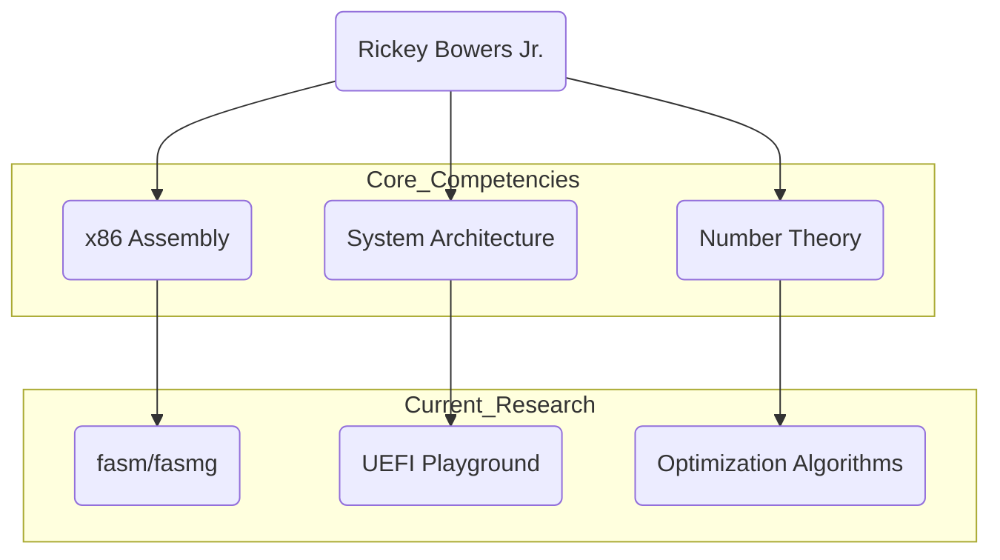
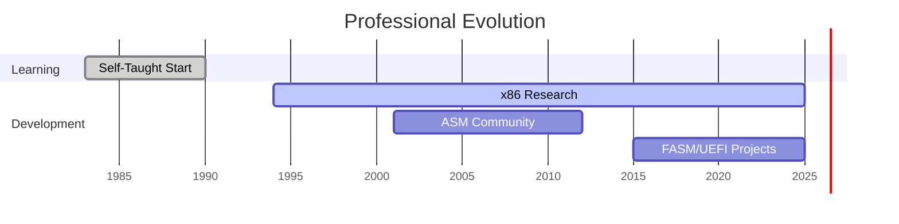

# Rickey Bowers Jr. (bitRAKE)

> Independent Software Developer | x86 & Number Theory Researcher | Idaho Falls, ID

Self-taught programmer since 1983 specializing in low-level optimization and system architecture. Primary focus includes research in x86 assembly (fasmg), UEFI exploration, and computational mathematics.

### 🛠 Architecture & Focus

###📡 Network & Archives
| Platform | Handle/Link | Context |
| --- | --- | --- |
| **GitHub** | [bitRAKE](https://github.com/bitRAKE) | Current Repositories |
| **ASM Community** | [Archive](https://www.google.com/search?q=https://asmcommunity.net) | Historical x86 Discussions |
| **flatassembler** | [Profile](https://board.flatassembler.net/search.php?search_author=bitRAKE) | Recent Assembly Research |
| **Twitter** | [@bitRAKE_hacked](https://twitter.com/bitRAKE_hacked) | Updates & Thoughts |
| **YouTube** | [Channel Link](https://www.youtube.com/bitRAKE) | Visual Projects |

###🧰 Preferred Toolchain**Development & Visualization**

* todo: ... (ask me if you need a tool for something)
* [Compiler Explorer](https://godbolt.org/) - Interactive compiler analysis
* [FASMG](https://flatassembler.net/) - Flat Assembler 'g'
* [ShaderToy](https://www.shadertoy.com/) - GLSL sandbox
* [Desmos](https://www.desmos.com/) - Graphing calculator
* [Draw.io](https://app.diagrams.net/) - Diagramming

**Reference & Reading**

* [Matt Godbolt](https://xania.org/) - Compiler Explorer author
* [Sam Russell](https://www.lodsb.com/) - Binary Ninja
* [Chris Wellons](https://nullprogram.com/) - skeeto
* [Strchr](http://www.strchr.com/) - Programming Blog
* [Alois Kraus](https://aloiskraus.wordpress.com/) - Performance is everything.
* [Daniel Lemire](https://lemire.me/blog/) - Computer Science/Optimization
* [Casey Muratori](https://caseymuratori.com/contents) - Computer, Enhance!
* [Futility Closet](https://www.futilitycloset.com/) - Curiosities
* [greentec](https://greentec.github.io/index_en/) - (Korean) ShaderToy Blog
* [The Buckblog](https://weblog.jamisbuck.org/) - assorted ramblings by Jamis Buck
* ... so many more to add ...

###📊 Activity Timeline (1983 - Present)

---

*Contact:* `[MyHandle]@gmail.com`
